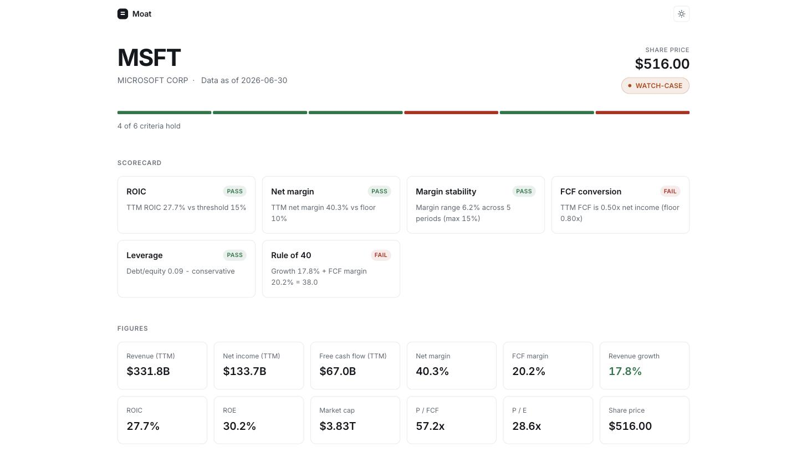

# Moat

Type a US-listed ticker and get an analyst report built from that company's own
SEC filings: quarterly financials pulled from EDGAR's XBRL API, value-investing
criteria scored in code, and a narrative from Claude in which **every quote is
string-matched against the filing before it reaches the page**. The model
interprets numbers it is given; it never calculates them, and it cannot cite a
passage that is not there. Where data is missing the report says so rather than
substituting zero.



---

## Why it exists

An LLM asked "does Microsoft compete with Google?" will answer yes — from
training data, not from the document in front of it. That answer is plausible,
unsourced, and useless for research. Moat is built around removing that failure
mode: the model must support every claim with a verbatim quote, and a string
matcher checks each one against the filing. A quote either appears in the
document or it does not.

## Architecture

```
Browser ──▶ FastAPI ──┬──▶ EDGAR XBRL API      numbers  ──▶ Postgres
                      ├──▶ EDGAR filing HTML   Item 1A prose
                      ├──▶ yfinance            market price
                      └──▶ Claude              narrative ──▶ grounding check
```

A request for an uncached ticker fans the three upstream fetches out in
parallel, stores the financials, computes every metric in Python, and only then
asks the model to interpret the finished figures. The page streams: computed
figures appear in about a second, the narrative when the model finishes.

```
moat/          application package
  main.py        HTTP routes, caching, rate limiting
  pipeline.py    the build as a sequence of progress events
  ingest.py      EDGAR XBRL → quarterly financials
  filings.py     10-K fetch and Item 1A extraction
  analysis.py    grounding: quote verification
  report.py      synthesis prompt and narrative assembly
  scoring.py     the six-criterion scorecard
  metrics.py     margins, ROE, ROIC, TTM
  views.py       server-rendered HTML, no framework
tests/         479 tests, ~3s, no network
evals/         two evaluation harnesses + a pinned filing fixture
migrations/    alembic
scripts/       one-off probes and the cold-start timing harness
```

## Engineering decisions worth explaining

**Grounding is a string match, not a judgement.** `analysis.check_quote`
compacts whitespace and folds typographic punctuation, then asks whether the
quote appears in the source. It forgives how a filing is typeset — filers split
words across HTML tags, and a model copying a passage types `"` where the
document has `"` — and forgives nothing about content. An empty quote returns
`False`: `"" in source` is true for every source, and a verifier that reports
success when it has verified nothing is worse than no verifier.

**The model narrates, it never calculates.** Every figure is computed from filed
data before the prompt is built, and handed over as a number. Asking a model for
ROIC produces a plausible figure with no provenance; giving it one produces
interpretation that can be audited against arithmetic.

**Unknown is not zero.** A company that did not report a line item has no value
for it. That absence survives ingestion, the metrics, the scorecard (`UNKNOWN`,
not `FAIL`), the JSON, and the page, where it renders as an em-dash. A missing
figure and a zero look different at every layer.

**Two evaluations, deliberately separate.** `evals/evaluate.py` measures the
*model* against 24 questions with known answers, including traps that should be
declined; it costs API credits and is sampled, so it cannot be deterministic.
`evals/grounding_replay.py` measures the *verifier* by replaying recorded
responses through the real code path against a pinned filing — free, offline,
deterministic, and run in CI on every push. The split exists because the
verifier is the part that has to be right.

**The page streams its own construction.** A cold ticker takes ~30s, almost all
of it the model writing. Rather than hold a blank document open, the server
answers immediately with a skeleton sized to the real content and pushes
Server-Sent Events as each stage lands. Worst-case layout shift is 3px,
measured in a browser.

**Degrade, never freeze.** A failed synthesis returns the computed figures with
the narrative marked absent — and is deliberately *not* cached, so the next
request retries instead of serving a verdict-less report for the full 7-day TTL.

## Running it

```bash
cp .env.example .env          # then set DATABASE_URL and ANTHROPIC_API_KEY
docker compose up --build
open http://localhost:8000
```

Migrations run automatically on container start.

<details>
<summary>Without Docker</summary>

```bash
python3.12 -m venv .venv && source .venv/bin/activate
pip install -r requirements-dev.txt
createdb moat && createdb moat_test
cp .env.example .env          # set DATABASE_URL; TEST_DATABASE_URL may stay blank
alembic upgrade head
python -m scripts.edgar_probe             # optional: check EDGAR is reachable
uvicorn moat.main:app --reload
```
</details>

## Tests and evaluations

```bash
pytest                          # 479 tests, ~3s, no network, no API key
python -m evals.grounding_replay # offline grounding eval — free, deterministic
python -m evals.evaluate         # paid eval against the live model
```

`pytest` mocks every upstream; a test that reaches the network fails with a
message naming the boundary it should have mocked. `grounding_replay` exits
non-zero if any recorded response reaches the wrong verdict. `evaluate` exits 0
when its hard gates hold, 1 when a quote fails verification, and 2 when it could
not run at all — a billing failure must not look like a grounding regression.

## Endpoints

| Route | |
|---|---|
| `/` | Search |
| `/company/{ticker}/report/view` | The report, streamed as it builds |
| `/company/{ticker}/report` | The same analysis as JSON |
| `/company/{ticker}/report/stream` | Server-Sent Events driving the page above |
| `/company/{ticker}` | Company record |
| `/company/{ticker}/brief?question=` | Grounded answer to any question about the 10-K |
| `/company/{ticker}/metrics` | Quarterly ratios and TTM aggregates |
| `/company/{ticker}/financials` | Raw quarterly data |
| `/companies` | Known companies, paginated |
| `/health` | Liveness, including a database check |
| `/docs` | Generated OpenAPI |

## Tech

Python 3.12, FastAPI, PostgreSQL 16, SQLAlchemy 2, Alembic, Anthropic API,
BeautifulSoup, Docker, pytest, ruff, GitHub Actions. No frontend framework —
the HTML is server-rendered and the only JavaScript is the ~40 lines that drive
the progress stream, the theme toggle and the search shortcuts.

## What it doesn't do

- **Banks and insurers.** They file under a different GAAP taxonomy. Rather than
  force it, the pipeline reports honest gaps.
- **Vector search over filings.** Item 1A is sliced out by document structure,
  which is exact and costs nothing. Semantic retrieval was prototyped and
  removed; see the note in `moat/models.py`.
- **Proper ROIC.** This uses TTM net income over gross debt plus equity. The
  textbook version uses NOPAT and nets out excess cash. Directionally right,
  and flagged in the code.
- **Tell you what to buy.** It is a screen against stated criteria. Valuation
  multiples are reported without a threshold, because what counts as expensive
  takes judgement the system does not have.
